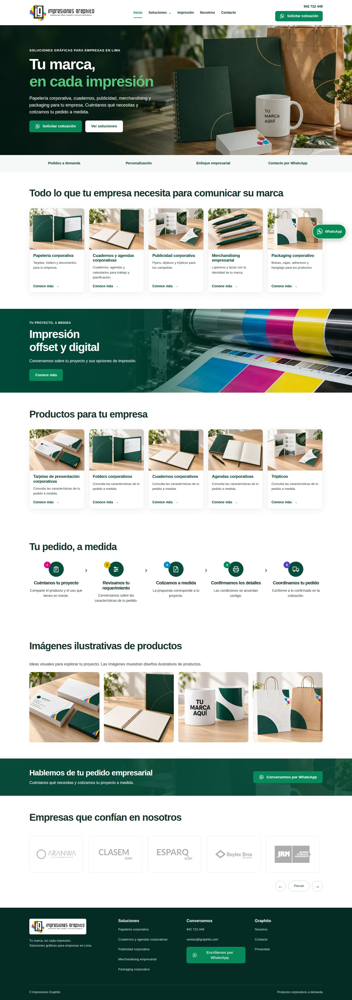
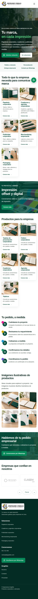
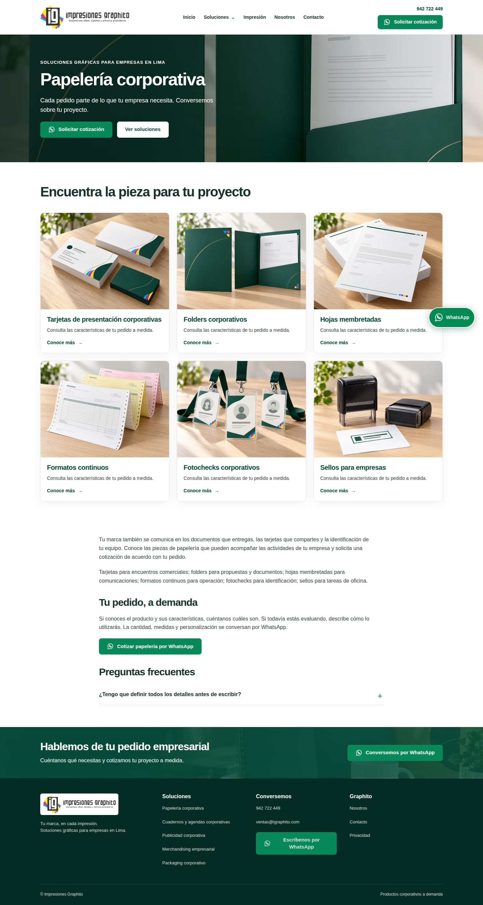
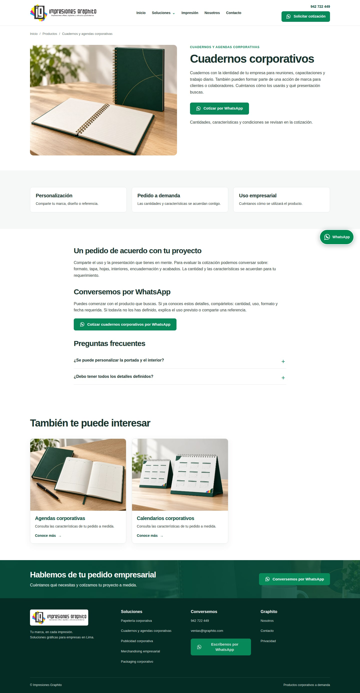
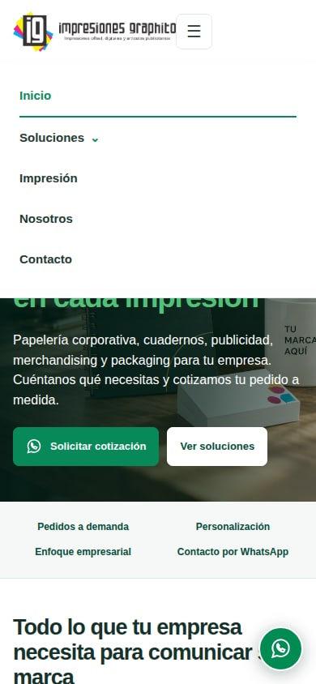

# Capturas de la web implementada

Capturas reales de Chromium, generadas desde el código del repositorio. No son mockups. Incluyen las imágenes finales integradas.

Validación aprobada para las 29 rutas en escritorio (1440 × 1000) y móvil (390 × 844), con comprobación del menú, carrusel, movimiento reducido, contacto de WhatsApp y navegación sin JavaScript. [Ejecución verificada](https://github.com/jimmygr4dos/igraphito-web/actions/runs/37568304674).

## Home — escritorio

## Home — móvil

## Papelería corporativa

## Cuadernos corporativos

## Menú móvil

Estas capturas corresponden a la implementación revisada; el sitio productivo sigue intacto. Antes de publicar se debe cerrar la validación de privacidad y confirmar los datos operativos pendientes documentados en [Publicación](publicacion.md).
